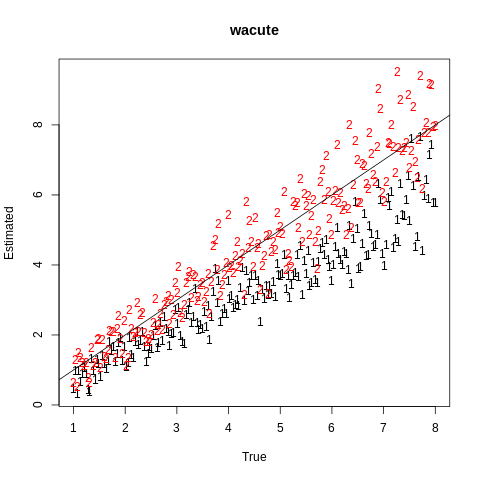
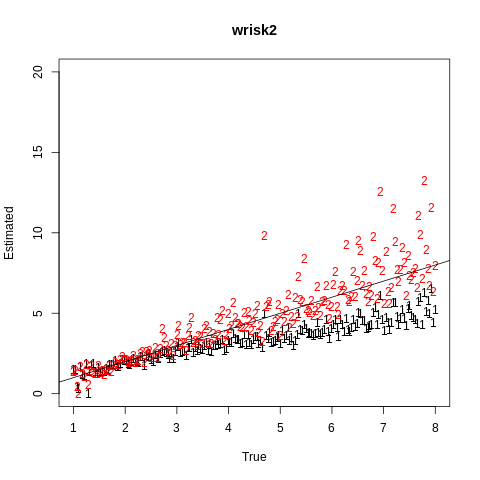
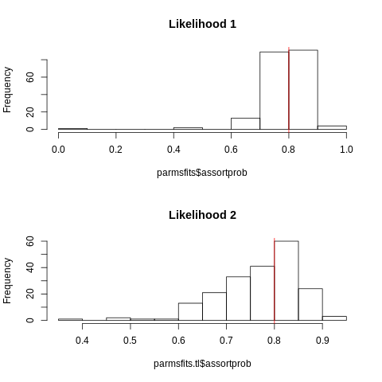

# phydynR simulations to compare likelihood approximations 

This simulation experiment is derived from the one (described here)[https://github.com/emvolz/PhyDyn-simulations]. 
Please see that page before proceeding. 

The model has been made more complex and the parameters more challenging to estimate by decreasing the duration of the first stage of infection (1 year). 
The model now includes progression from the high transmission risk group to the lower transmission risk group. 
This is meant to resemble the situation described in this publication:

* [Molecular Epidemiology of HIV-1 Subtype B Reveals Heterogeneous Transmission Risk: Implications for Intervention and Control](https://doi.org/10.1093/infdis/jiy044) 

In short, this paper describes a phylodynamic analysis of HIV in the United Kingdom focusing on the role of young individuals as a potential core group. We found that the young age group had higher transmission risk and high assortativity (transmission within as opposed to outside the risk group). 

The model now includes an assortativity parameter, which is estimated, and which controls the proportion of transmissions within risk groups. 

Other changes to the simulations include: 
1. Larger sample size 
2. Larger population size
3. Samples more concentrated near present (last 5 years)

The default parameters are (as an R list):
```
parms0 <- list( 
 mu = 1/40         # natural mortality rate 
 , gamma0 = 1      # rate per year of progressing from 1st stage to 2nd stage of infection
 , gamma1 = 1/9    # rate per year of death in 2nd stage 
 , beta = 1/4      # transmission rate
 , wrisk2 = 5      # transmission risk ratio for high risk group 
 , wacute = 5      # transmission risk ratio for early stage of infection 
 , init_acute = 1  # initial conditions 
 , S0 = 5e3        # initial susceptible size 
 , prisk2 = .30    # expected proportion in high risk group 
 , assortprob=0.80 # proportion of transmissions reserved for within-group 
 , agerate = 1/5.  # rate of 'aging' out of high risk group to low risk group 
)
```

The simulation experiment varies the `wrisk2` and `wacute` parameters between 1 and 9. We then assess how well the estimated parameters match the input parameters. Other parameters which are estimated are `beta`, `init_acute` and `assortprob`. We assume that stage progression, mortality, and population size are known. Parameters are estimated by maximum likelihood. 

The _migration_  matrix for the model is specified in phydynR format as follows, which shows the main difference with the earlier simulation study 
```
M <- matrix( '0.', nrow=m, ncol=m) # m is the number of demes
rownames(M) = colnames(M) <- demes # 'demes' is a character vector with deme names: acute, chron, acute2, chron2

M['acute', 'chron']   <- 'gamma0 * acute' # clinical stage progression 
M['acute2', 'chron2'] <- 'gamma0 * acute2' # clinical stage progression 
M['acute2','acute']   <- 'agerate * acute2' # aging from young to old 
M['chron2', 'chron']  <- 'agerate * chron2' #aging from young to old 
```

## Reproducing results 

Requirements: 
* Python 2 with _matplotlib_
* R with the testing branch of the _phydynR_ package: [](https://github.com/emvolz/phydynR.r0.1.2)

1. The simulated data can be generated in parallel by running the script `python sim0.py`. Revise the `NP` parameter to set the appropriate number of cores to use on your computer.
2. Parameters can be re-estimated by maximum likelihood using the R script: `Rscript mltest.R sim0`
Again, change the `NCPU` parameter to use the appropriate number of cores on your system. 
3. Results can be printed and plotted using the R script: `Rscript a0.R`

Note that both steps (1) and (2) will take a long time (about 12 hours on 40 cpu's for 200 simulations)! 


## Results 

Estimates are shown using two different likelihood approximations
1. The likelihood described in the supplement of this paper: [](https://doi.org/10.1093/ve/vex014)
2. The likelihood described in this paper: [](https://www.biorxiv.org/content/early/2018/04/10/268052)
Note there is additionally a 'fast' approximate likelihood described in this paper, but we have not included it in this comparison 

The 2nd is about 80% slower than the 1st in these simulations. 

This figure compares ML estimates of _wacute_:



This figure compares ML estimates of _wrisk2_:



This figure shows the distribution of MLE's of the assortativity parameter (true value = 80%): 



Here is a summary of bias and precision for the two likelihoods and two parameters: 
```
-------bias wacute:
Likelihood 1: 
   Min. 1st Qu.  Median    Mean 3rd Qu.    Max. 
-0.1427  0.6270  1.1535  1.1932  1.6753  3.3541 
Likelihood 2: 
     Min.   1st Qu.    Median      Mean   3rd Qu.      Max. 
-2.252865 -0.389439  0.042745  0.004608  0.459772  1.819756 

-------rmse wacute:
Likelihood 1: 
[1] 1.406765
Likelihood 2: 
[1] 0.6970283

-------bias wrisk2:
Likelihood 1: 
   Min. 1st Qu.  Median    Mean 3rd Qu.    Max. 
-0.6195  0.3490  1.1240  1.1690  1.9298  3.5199 
Likelihood 2: 
    Min.  1st Qu.   Median     Mean  3rd Qu.     Max. 
-5.59893 -0.58840 -0.02481 -0.24933  0.38463  1.61842 

-------rmse wrisk2:
Likelihood 1: 
[1] 1.521454
Likelihood 2: 
[1] 1.15619

```

## Summary 

Likelihood 2 has superior performance by every metric, however is substantially slower. 
